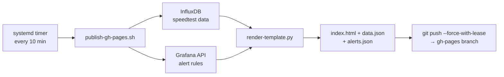
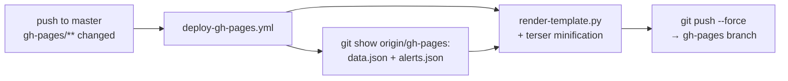
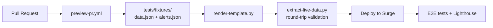
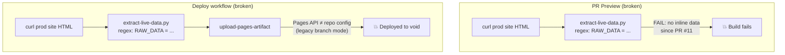
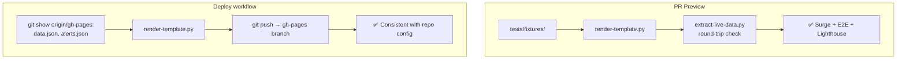

# CI/CD Pipeline — GitHub Pages Deployment

## Architecture

Two independent systems publish the monitoring page to GitHub Pages:

### 1. RPi (systemd timer) — Data pipeline

Runs on the Raspberry Pi every 10 minutes. This is the **primary data source**.

### 2. CI workflow (GitHub Actions) — Template rebuild

Triggered on push to `master` when frontend files change. Re-renders the page
template with **existing data** (from the gh-pages branch, not from production).

### 3. PR preview (Surge)

Triggered on pull requests. Builds from **test fixtures** (no production dependency).

## Data flow — Before vs After

### Before (broken)

### After (fixed)

## Key principles

1. **PR CI never depends on production** — uses versioned fixtures from `tests/fixtures/`
2. **Round-trip validation** — PR preview runs `render-template.py` then `extract-live-data.py` to verify pipeline consistency
3. **Single deployment method** — both RPi and CI use `git push` to the `gh-pages` branch (matches repo config: "Deploy from branch")
4. **Graceful fallbacks** — local scripts try live JSON → gh-pages branch → fixtures

## Concurrency

The RPi pushes every 10 minutes. The CI pushes on template changes. Both use `--force` to the same branch. The last writer wins, which is acceptable because:

- RPi writes **fresh data + current template**
- CI writes **existing data + updated template**
- The RPi will overwrite CI's push within 10 minutes with fresh data + the updated template (since it does `git pull` first)
